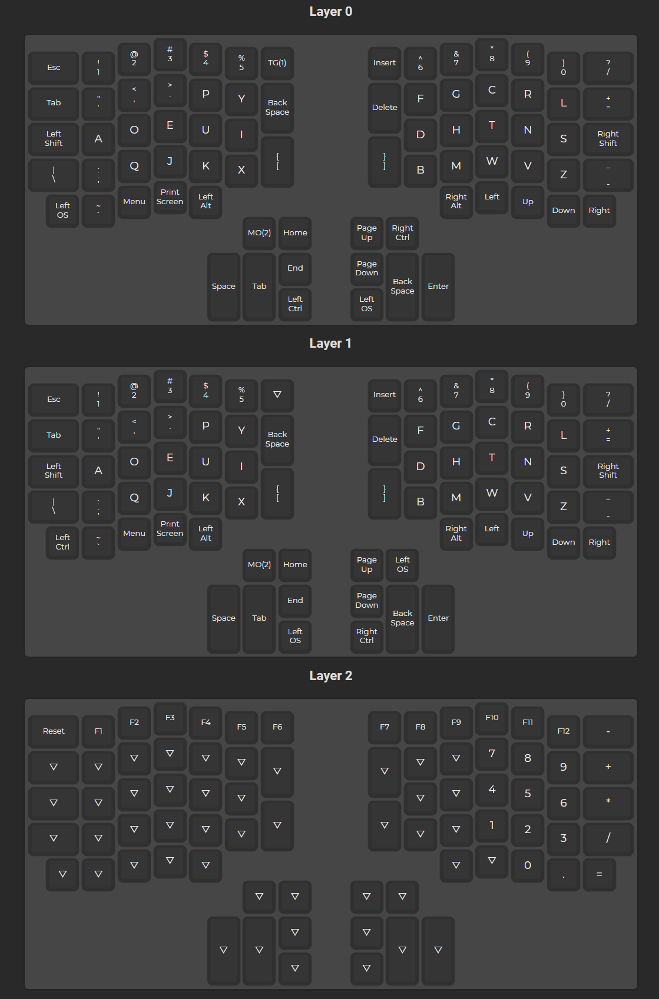

# hotdox Progamming

Original guide is [here](https://www.keychatter.com/2019/04/09/build-guide-ergodox-76-hot-dox/)

1. Navigate to the online [QMK Configurator](https://config.qmk.fm/#/hotdox/LAYOUT_ergodox)
2. Map Your Layout
3. Compile Your Firmware
4. Download Your Firmware 
5. Download [QMK Toolbox](https://github.com/qmk/qmk_toolbox/releases)
6. Open QMK Toolbox 
7. Load the .hex file into QMK Toolbox
8. Put Hot Dox into DFU Mode
9. Flash Your Keyboard

# Current layout

